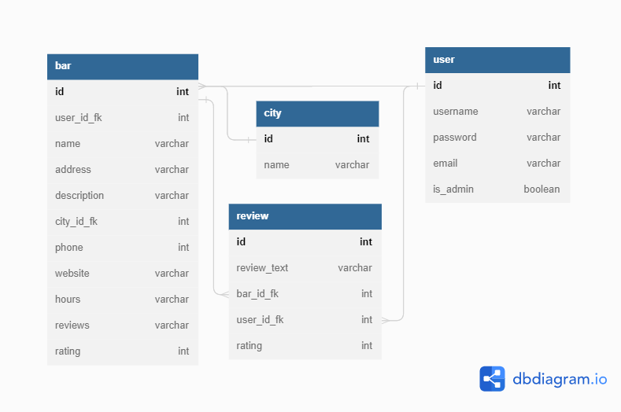

# BARKARTAN

---

Gruppuppgift i kursen API-utveckling @ Medieinstitutet, Stockholm.

---

## Contributors

Projektet är byggt av:

**Lisa Lindblom**
**Julia Carlberg**
**Nina Khodnia**

---

## Om projektet

I projektet har vi arbetat med databasdesign, där vi byggt ett REST API vars data har lagrats i en SQLite databas.

Syftet med projektet är att strukturera upp användarhantering och login, hantera recensionsdata samt övrig data för våra valda företag.

Byggt med:

Express
node.js
SQLite

---

## SQLite databasdesign



## Users

````
users = [
  {
    username: "lisa",
    password: "lösenord",
    email: "lisa@gmail.com",
    is_admin: 1,
  },
  {
    username: "julia",
    password: "lösenord",
    email: "julia@gmail.com",
    is_admin: 0,
  },
  {
    username: "nina",
    password: "lösenord",
    email: "nina@gmail.com",
    is_admin: 0,
  },
  {
    username: "felicia",
    password: "lösenord",
    email: "felicia@gmail.com",
    is_admin: 0,
  },
  {
    username: "loke",
    password: "lösenord",
    email: "loke@gmail.com",
    is_admin: 0,
  },
  {
    username: "petter",
    password: "lösenord",
    email: "petter@gmail.com",
    is_admin: 0,
  },
];
```
````
